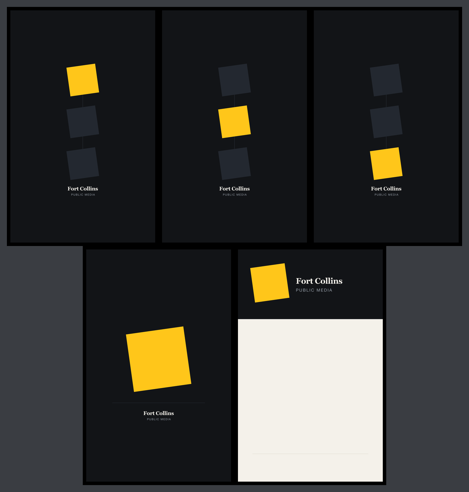

# Brand assets for the screens in the building

Desktop backgrounds and the idle screen for the studio panels, outside `site/` so none of it can
reach a public URL. Screens and dim: [`docs/kiosk.md`](../docs/kiosk.md).

| file | what it is | where it goes |
| --- | --- | --- |
| `wallpaper/plate-*` | one mark, one rule, one lockup, low on the canvas, clear of desktop icons | anywhere; the default |
| `wallpaper/tally-1-*`, `-2-`, `-3-` | three marks in a column, a different one lit in each | the three panels, left to right |
| `wallpaper/band-*` | the masthead across the top, then paper | the panel by the door |
| `idle/index.html` | the mark (`idle/dim.js`, `dim.css`) and a clock, no network; `#slot` takes one line, `?say=Back at 2pm` fills it | any panel, full screen (F11; macOS ⌃⌘F) |

`bin/make-wallpaper.py` writes each design at `1050x1680` (portrait) and `1680x1050`, SVG (the source) and PNG (needs `rsvg-convert`: `brew install librsvg`). Edit the generator.
Other sizes: `--size 2160x3840`; one design: `--design plate`; `--no-text` drops the lockup.

**Windows:** Settings → Personalization → Background, fit **Fill** (not Span), add the files, then in *Recent images* right-click each → *Set for monitor N*.
**macOS:** System Settings → Wallpaper, **Fill Screen**, per display.

## The tilt

The mark leans counterclockwise, −8°, as `site/assets/img/icon.svg` and `.wordmark-mark` do. The other way is a mistake
(`site/assets/img/icon-inverted.svg` corrects one copy); `bin/test_make_wallpaper.py` fails if the sign flips.
